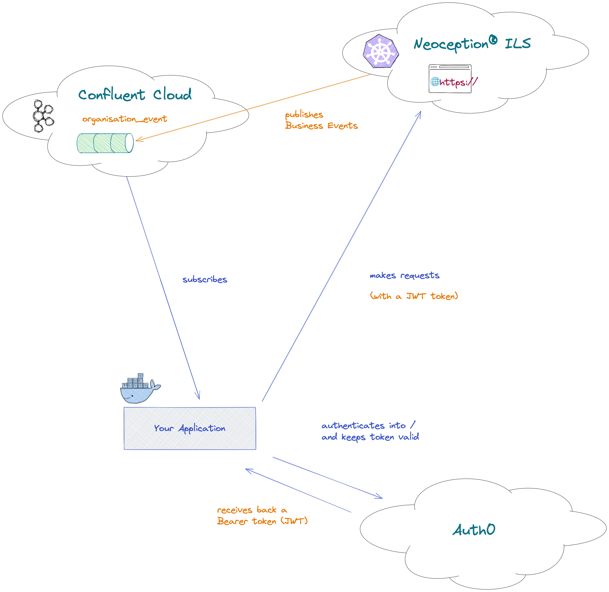

# Introduction

The sample code, provided by Neoception®, intends to show off how can one implement a simple integration service
utilising the ILS API and ILS Event API.

Feel free to modify and adjust it to your own needs, however please bear in mind that it comes without any guarantee as
something production ready or having a perfect fit to your specific Use Cases.

# Requirements

## Development environment

- Docker
- Python 3.10
- [pipenv](https://pipenv.pypa.io/)

## ILS Access

- Preconfigured Supermarket
- Credentials for the ILS REST API
- Credentials for the ILS Event API

## Concepts

- Basic understanding of Python
- Basic understanding of Docker
- Basic understanding of what is a Broker and Message Queues
- Basic development skills to adapt code, in order to consume a REST API and a Kafka topic (sample code provided)

# Sample Use Case

This application shows an academic approach to "linked Kanban Control Cycles".
> The term *academic* is to be read as *something simplified, but easy to understand, with the foundation logic to
further implement the required behaviour*

## How does it work?

The ILS Event API allows developers to subscribe **Business Events** occurring on an organisation.
Our application will particularly be listening to a "Carrier Pick event" occurring on a specific Lane.
On the event of a Carrier Pick getting triggered, the application will Signal a Light on another predefined Lane.

What makes this sample code "academic" is the way that the logic is hardcoded to only work between two predefined Lanes.
A "Real World" implementation should be dynamic and prepared for change, however this is out of scope.



## Where to go from here?

After becoming familiar to the ILS API, ILS Event API and this sample code you should be able to easily extrapolate
further logic to implement your own Use Cases.

The most common implementation pattern comes from subscribing a specific Business Event and then perform an action.

This action is not necessarily a request to the ILS API (as shown), you can communicate to an external system (e.g.
order a Material from a Logistics Platform), store data on a Database for later analysing / reports, etc.

## How to "deploy this application on a real server"?

The main purpose of providing a sample application, running from Docker is to guarantee that it is ready for either
being deployed on a real cluster (e.g. a Kubernetes cluster) or simply ensure it will run "seamlessly" on any platform.

> ⚠️ Please bear in mind this mostly depends on the application code and base Docker images being compatible with a
> specific platform.
> Also please understand that between having a "Docker Image" and running it on a cluster there are some ground to
> cover.

In theory, you should be able to run this application from your laptop, VM, Raspberry PI, independently of the Host OS.
In reality, it "depends".

> ⚠️ Like mentioned above, in theory it should run everywhere however, setting it up on Windows (even with WSL2) or any
> other platform other than `amd64` might bring specific challenges. Always test your intended platforms ahead of time to
> uncover rabbit holes on earlier stages to avoid nasty surprises on top of a deadline.

If you ensure this application behaves as it should from Docker, all the time, you can for example leave it running on a
VM by just executing a command like
`docker compose build && docker compose up -d` not worrying that the application will stop after a reboot (for example).

> 👉 This means that you just need to ensure the target machine has Docker installed

This is not the "Real World" way of deploying something into production, but it is a very acceptable way for the current
context.
It should be "robust enough" and avoid the common problem of something "Running ok on my laptop" but not "Running
ok on colleague someone's laptop".

This method is actually a good way to go between colleagues during development, but we can also "make it work here".

Ultimately this is your decision.

# Getting started

> ⚠️ First be sure you fulfill all the [requirements](#requirements).

This application require licensed access to Neoception® ILS resources and consequently credentials.
Secrets are to be kept on a `local.env` file (you can refer to `dev.env` for the environment variables you must
maintain).

The aforementioned files are just a mere convention, but if you want to use this code without further modifications you
need to adhere to them.

> ⚠️ These credentials should be kept on a safe place, so please do not store them on a source control repository on the
> clear.

Having prepared your `local.env` file you then just need to run the following command:

```bash
docker compose build && docker compose up -d
```

To stop:

```bash
docker compose down
```

# Usage

With the [application running](#getting-started), you can proceed to your predefined Lane and **pick a Carrier**.
The ILS Event API will trigger an event and this application, upon notification received, will **make the other
predefined Lane to blink**.

# 101 Development

> You are strongly advised to start with a good IDE like PyCharm in case you have no personal preference or are not
> familiar with a bit more serious Python development.

If using PyCharm, be sure you set up the Python interpreter
to [pipenv](https://www.jetbrains.com/help/pycharm/pipenv.html).

> ⚠️ Always install your Python packages through `pipenv`. If using PyCharm, see
> how [here](https://www.jetbrains.com/help/pycharm/using-pipfile.html).
>
> **This is key** so your application can be built properly on Docker or any other machine besides yours.

Be sure your IDE can load `.env` files, so you can debug properly the application.

> If using PyCharm, be sure to install the `EnvFile` plugin in order to load the `.env` files when launching the application.

## Learning material

Here are some hints to improve development skills. Feel free to use your own resources.

- [Python](https://www.youtube.com/watch?v=t8pPdKYpowI)
- [Docker](https://www.youtube.com/watch?v=3c-iBn73dDE)
> ⚠️ [Nana's videos](https://www.youtube.com/@TechWorldwithNana) are usually very good, however the suggestions come without a complete review.
- [Git](https://youtu.be/mJ-qvsxPHpY)
> ⚠️ This is a very simple/gentle introduction to the topic, you are strongly advised to source control your work!

### Nice to know

If you want to level up your knowledge a bit:

- [Rest API](https://youtu.be/lsMQRaeKNDk)
- [Kafka](https://youtu.be/B5j3uNBH8X4)
- [Swagger UI](https://youtu.be/7MS1Z_1c5CU)